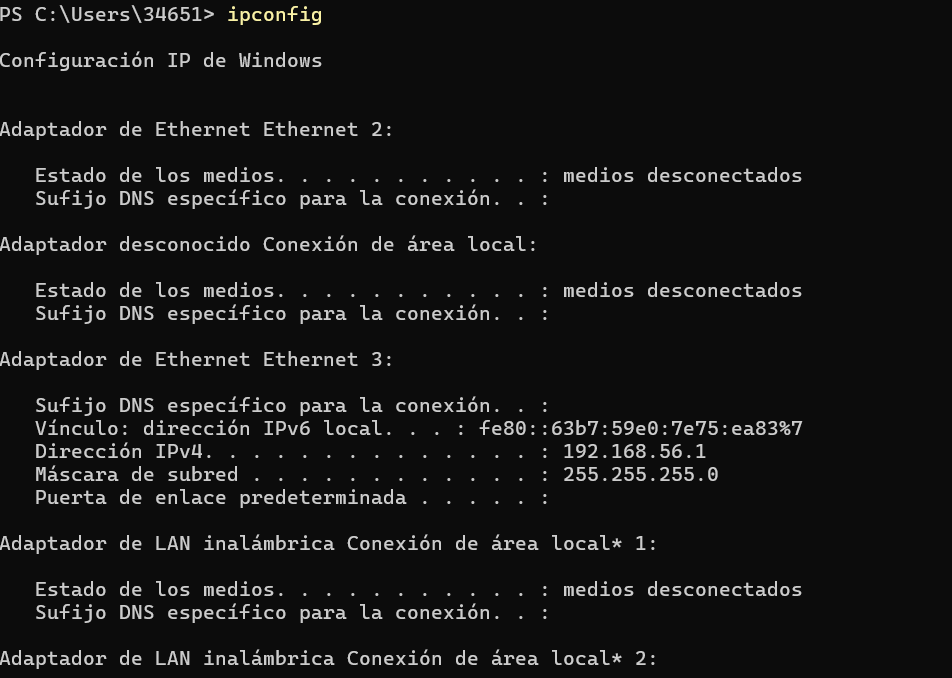
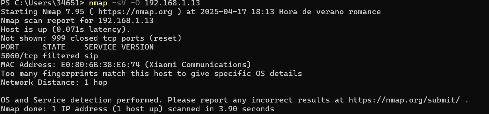
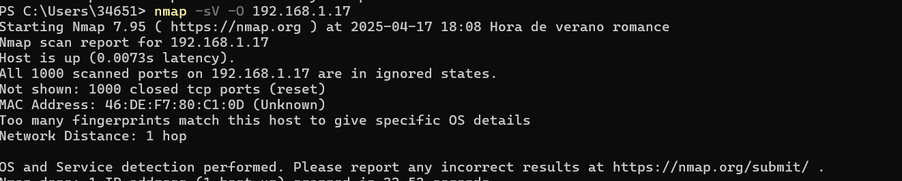

# Proyecto: Análisis de Red Local con Nmap

Este proyecto simula un reconocimiento real de red utilizando la herramienta **Nmap** desde un equipo Windows, con el objetivo de detectar dispositivos conectados, analizar puertos abiertos, servicios expuestos y posibles huellas de sistemas operativos en una red doméstica.

---

## Herramientas utilizadas

- 💻 Sistema operativo: Windows 10
- 🌐 Nmap versión 7.95

---

## Objetivo del proyecto

1. Explorar una red local (`192.168.1.0/24`)
2. Detectar dispositivos activos
3. Seleccionar objetivos específicos
4. Analizar puertos, servicios, y fabricantes
5. Documentar hallazgos como parte de una auditoría de red

---

## Paso 1: Descubrimiento de red

Se ejecutó el siguiente escaneo para detectar todos los dispositivos conectados:

```bash
nmap -sn 192.168.1.0/24
```

📸 

Este escaneo reveló varios dispositivos activos, incluyendo:

- Router Livebox (`192.168.1.1`)
- Dispositivo Xiaomi (`192.168.1.13`)
- Repetidor TP-Link (`192.168.1.12`)
- Dispositivo desconocido (`192.168.1.17`)

---

## Paso 2: Análisis del dispositivo Xiaomi (`192.168.1.13`)

Se realizó un escaneo detallado sobre uno de los dispositivos detectados:

```bash
nmap -sV -O 192.168.1.13
```

📸 

### Resultado relevante:

- Se detectó el puerto **5060/tcp** con estado **filtrado**
- Protocolo asociado: `sip` (Session Initiation Protocol)
- Fabricante: **Xiaomi Communications**

### Interpretación:

El puerto 5060 es usado por servicios de **VoIP** (voz sobre IP), como llamadas y videollamadas de aplicaciones como WhatsApp, Zoom o Google Meet. El estado “filtrado” indica que el puerto no está completamente cerrado, pero está protegido por un firewall o esperando conexión bajo ciertas condiciones.

No se puede confirmar si el dispositivo estaba realizando llamadas en ese momento, pero su exposición indica **posible soporte para comunicación SIP**.

---

## Paso 3: Escaneo de dispositivo desconocido (`192.168.1.17`)

```bash
nmap -sV -O 192.168.1.17
```

📸 

### Resultado:

- Todos los puertos aparecen como **cerrados o filtrados**
- No se detecta sistema operativo ni fabricante conocido

Esto sugiere un dispositivo oculto o fuertemente protegido por firewall. Podría tratarse de un móvil, un electrodoméstico inteligente (IoT) o un dispositivo de red silencioso.

---

## Conclusión

Este análisis demuestra cómo Nmap puede ser una herramienta poderosa para obtener visibilidad dentro de una red local. Permite detectar no solo qué dispositivos están conectados, sino también qué puertos y servicios podrían estar expuestos.

🔐 Esta información puede ser usada tanto por auditores de seguridad como por administradores de red para tomar decisiones sobre la exposición de sus sistemas.

---

## Autora:

**María Victoria Romero Ruíz**  
Estudiante de ciberseguridad con enfoque en análisis de red, pentesting web y desarrollo seguro.  
🔗 [GitHub: @Mariaromeroruiz](https://github.com/Mariaromeroruiz)

---

## Añadido a mi portfolio

👉 Puedes ver este proyecto en mi portfolio online:  
[https://mariaromeroruiz.github.io/portfolio-mariaromeroruiz](https://mariaromeroruiz.github.io/portfolio-mariaromeroruiz)

---
